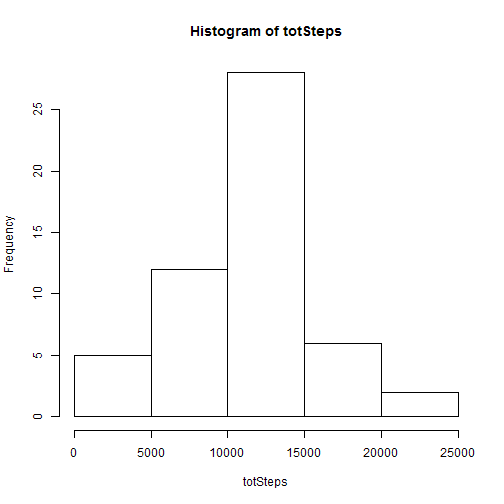
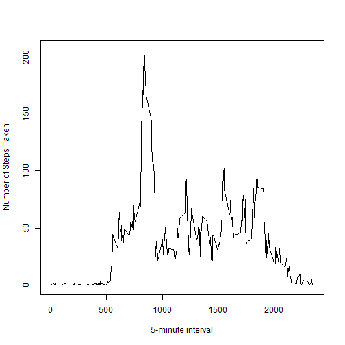
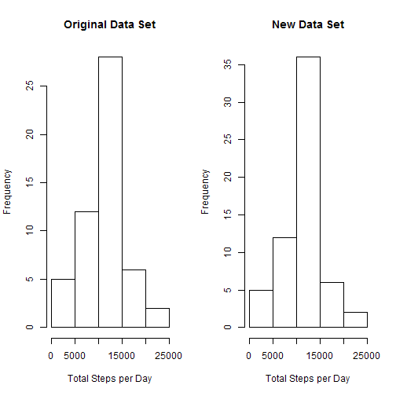
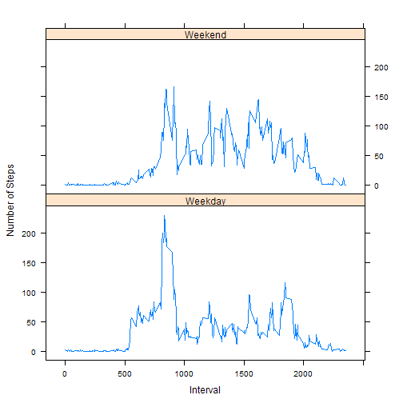

# Reproducible Research: Peer Assessment 1


## Loading and preprocessing the data


```r
setwd("~/GitHub/RepData_PeerAssessment1")
df <- read.csv("activity.csv")
df$date <- as.Date(df$date, "%Y-%m-%d")
```


## What is mean total number of steps taken per day?

First we clean the data set by removing NA values, then we find the total number of steps per day.


```r
library(reshape2)
df2 <- df[!is.na(df$steps), ]
totSteps <- tapply(df2$steps, df2$date, sum)
totSteps <- totSteps[!is.na(totSteps)]
```


Here is a histogram of the total number of steps per day.


```r
hist(totSteps)
```

 


The mean number of steps taken per day is:


```r
mean(totSteps)
```

```
## [1] 10766
```


The median number of steps taken per day is:


```r
median(totSteps)
```

```
## [1] 10765
```


## What is the average daily activity pattern?


```r
meanSteps <- tapply(df2$steps, df2$interval, mean)
plot(names(meanSteps), meanSteps, type = "l", xlab = "5-minute interval", ylab = "Number of Steps Taken")
```

 


To find the time interval with the highest average number of steps, we use the which.max function:


```r
which.max(meanSteps)
```

```
## 835 
## 104
```


## Imputing missing values

For missing (NA) values, we will first compute a "default day" of data, consisting of the mean for 
the missing time interval.


```r
defaultDay <- data.frame(mean = meanSteps)
```


Now we create a new data set that is equal to the old one, but with the NA values filled in with these defaults.


```r
df3 <- df
df3$steps[is.na(df3$steps)] <- defaultDay[as.character(df3$interval[is.na(df3$steps)]), 
    ]
```


Let's compare the total number of steps per day of this new data set to the original.


```r
totSteps3 <- tapply(df3$steps, df3$date, sum)
par(mfrow = c(1, 2))
hist(totSteps, main = "Original Data Set", xlab = "Total Steps per Day")
hist(totSteps3, main = "New Data Set", xlab = "Total Steps per Day")
```

 


There are slight differences in the new data set, but the overall pattern seems to be the same.

## Are there differences in activity patterns between weekdays and weekends?

First we separate weekends from weekdays.


```r
df3$weekendQ <- (weekdays(df3$date) == "Saturday") | (weekdays(df3$date) == 
    "Sunday")
```


Now we reshape the data and compute means.


```r
meltedData <- melt(df3, id = c("weekendQ", "interval"), measure.vars = c("steps"))
meanData <- dcast(meltedData, weekendQ + interval ~ variable, mean)
meanData$dayType <- factor(meanData$weekendQ, labels = c("Weekday", "Weekend"))
```


Finally, we create a lattice plot of our weekday and weekend data sets.


```r
library(lattice)
xyplot(steps ~ interval | dayType, data = meanData, type = "l", layout = c(1, 
    2), xlab = "Interval", ylab = "Number of Steps")
```

 


